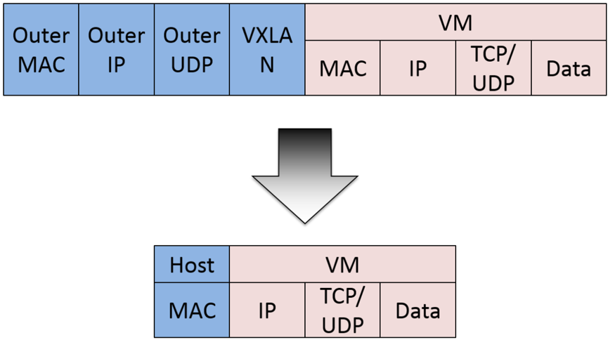
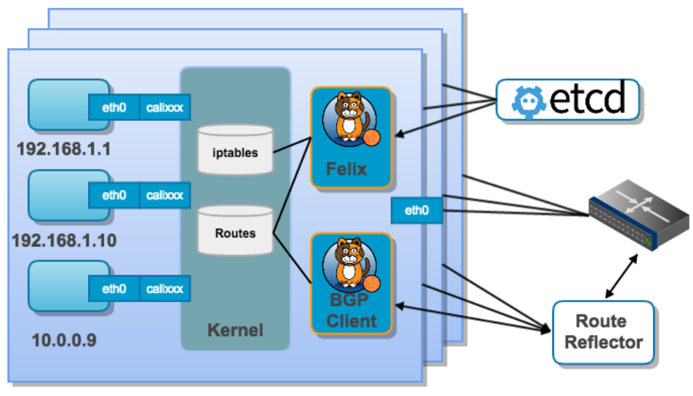

### calico 介绍
Calico 是一个纯三层的数据中心网络方案，能够提供可控的虚拟机、容器、裸机之间的IP通信。

通过将整个互联网的可扩展网络原则压缩到数据中心级别，calico在每一个计算节点利用Linux内核实现了一个高效的vRouter来负责数据转发，而每个vRouter通过BGP协议负责把自己上运行的workload的路由信息向整个calcio网络内广播。小规模部署时各计算节点可以直接互联，大规模部署时可通过指定的BGP route reflector来完成。
这样保证最终所有的workload之间的数据流量都是通过IP路由的方式完成互联的。

calico 流量流程图

calico 节点组网可以直接利用数据中心的网络结构（无论是L2或者L3），不需要额外的NAT、隧道或者overlay网络

calico封包图

如上图所示，这样保证这个方案的简单可控，而且没有封包解包，节约CPU计算资源的同时，提高了整个网络的性能。

此外，calcio基于iptables还提供了丰富而灵活的网络策略，保证通过各个节点上的ACL2来提供计算节点的多租户隔离、安全组以及其他可达性限制等功能。

### calico 架构

calico架构图

* Felix：是calico agent，运行在每台需要运行workload的节点上，主要负责配置路由及ACL2等信息来确保Endpoint的连通状态。
* etcd：分布式键值存储，主要负责网络元数据一致性，确保calico网络状态的准确性。
* BGP Client（BIRD）：主要负责把 Felix 写入 Linux 内核的路由信息分发到当前calico网络，确保workload间通信的有效性。
* BGP Route Reflector（BIRD）：大规模部署时使用，摒弃所有节点互联的网格模式，通过一个或者多个BGP Route Reflector来完成集中式的路由分发。

### calico 网络通信模型
在主机网络拓扑的组织上，calcio是在主机上启动虚拟机路由器，将每个主机作为路由器使用，组成互联互通的网络拓扑。

每个主机上都部署了 calico node 作为虚拟路由器，并且可以通过 calico 将宿主机组织成任意的拓扑集群。当集群中的容器需要与外界通信时，就可以通过BGP协议将网关物理路由器加入到集群中，使外界可以直接访问容器IP，而不需要做任何NAT之类的复杂操作。
当容器通过 calico 进行跨主机通信时，其网络通信模型如下图所示：

从上图可以看出，当创建容器时，calcio 为容器生成 veth pair，一端作为容器网卡加入到容器的网络命名空间，并设置IP地址和子网掩码，一端直接暴露在宿主机上，并通过设置路由规则，将容器IP暴露到宿主机的通信路由上。与此同时，calico为每个主机分配了一段子网作为容器可分配的IP范围，这样就可以根据子网的CIDR为每个主机生成比较固定的路由规则。

当容器需要跨主机通信时，主要经过以下步骤：
1）容器流量通过 veth pair 到达宿主机的网络命名空间上。
2）根据容器要访问的 IP 所在的子网 CIDR 和主机上的路由规则，找到下一跳要到达的宿主机 IP。
3）流量到达下一跳的宿主机后，根据当前宿主机上的路由规则，直接到达对端容器的 veth pair 插在宿主机的一端，最终进入容器。

从上面的通信过程来看，跨主机通信时，整个通信路径完全没有使用 NAT 或者 UDP 封装，性能上的损耗确实比较低。

由于calcio的通信机制是完全基于三层的，这种机制也带来了一些缺陷，例如：
1）calcio 目前只支持 TCP、UDP、ICMP、ICMPv6协议，如果使用其他四层协议（例如NetBIOS协议），建议使用weave、原生overlay等其他overlay网络实现。
2）基于三层实现通信，在二层上没有任何加密包装，因此只能在私有的可靠网络上使用。
3）流量隔离基于iptables实现，并且从etcd中获取需要生成的隔离规则，有一些性能上的隐患。

### 注意事项
1、部署calcio workload的各节点机的hostname最好全部不同，否则会导致写入etcd的数据发生覆盖，但是可以通过在启动calcio node时，指明calico node的名称来避免。
2、calcio workload的各节点机的eth0网卡的IP段和calcio的网段必须不同，可通过修改calcio网段解决。

### 参考资料
https://www.goodrain.com/docs/stable/operation-manual/network/calico.html#calico

http://blog.51cto.com/dengaosky/2069666