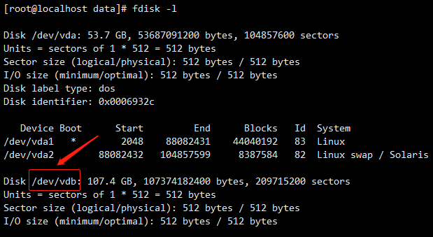
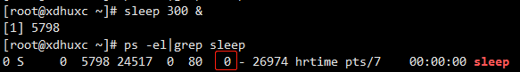
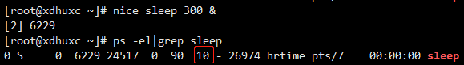
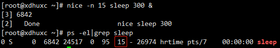
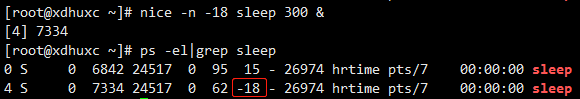
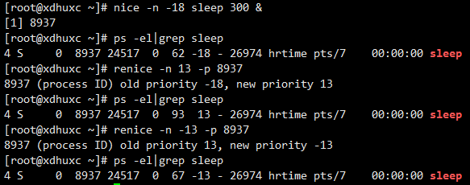

### 挂载磁盘
1、使用fdisk –l（查看当前系统所有硬盘及分区情况）， 找到待挂载的磁盘。


2、创建分区待挂载的目录，例如/xdhuxc，必须是空目录。
```angular2html
mkdir /xdhuxc
```
3、格式化新建的磁盘分区。
```angular2html
mkfs.ext4 /dev/vdb
```
4、修改/etc/fstab，添加如下内容，将分区信息写进去。
```angular2html
/dev/vdb  /xdhuxc      ext4    defaults        0 0
```
5、执行如下命令，加载所有在fstab中记录的文件系统。
```angular2html
mount –a
```
### 打包时的文件格式转换和赋权
```angular2html
find ./ -regex '.*\.sh$' -or -regex '.*\.exp$' | xargs chmod 755 > /dev/null
find ./ -regex '.*\.sh$' -or -regex '.*\.exp$' | xargs dos2unix -q
```

### 使用curl不产生输出
```angular2html
curl -s http://www.baidu.com 2>&1 > /dev/null
```

### 调整进程优先级
#### nice 命令
nice 命令可以修改进程的优先级，进而调整进程的调度。nice 命令是在进程启动时调整进程的优先级。nice 值的范围为：[-20, 19]，-20 表示进程的最高优先级，19 表示进程的最低优先级。Linux 进程的默认 nice 值为：0。使用 nice 可调整进程的优先级，这样调度器就会依据进程优先级为其分配 CPU 资源。
1、执行命令 `sleep 300 &`，然后查看该进程


没有 nice 命令，进程优先级数值为 0，进程优先级 NI 默认值为：0

2、执行命令 `nice sleep 300 &`，然后查看该进程

使用 nice 命令后，优先级 NI 的数值为 10，nice 命令将 NI 默认调整为 10，降低了该进程的优先级。

3、执行命令 `nice -n 15 sleep 300 &`，然后查看该进程


在默认值 0 的基础上加 15，非管理员可以将 NI 值调整为 0~19 之间的任意值，降低了进程的优先级。

4、执行命令 `nice -n -15 sleep 300 &`，然后查看该进程


仅管理员可以在默认值的基础上 -n，调高进程的优先级，普通用户无权调高进程优先级。

##### 使用场景
在实际应用中，如果要运行一个 CPU 密集型程序，就可以通过 nice 命令来启动它，这样可以保证其进程获得更高的优先级，即使服务器或者台式机在负载很重的情况下，也可以快速响应。

#### renice 命令

renice 命令可以重新调整进程执行的优先级，可以指定群组或者用户名调整进程优先级等级，并修改隶属于该群组或用户的所有程序优先级。等级范围为：[-20, 19]，同样，只有管理员可以调高优先级，用于调整运行中的进程的优先级。

使用方法和 nice 相同



##### 使用场景
一个紧急进程，需要更多的 CPU 资源时，可以调高运行中的该进程。

