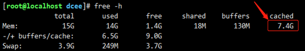
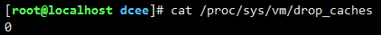
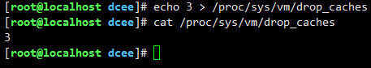

### cpu


### 内存


### 磁盘


### 网络


### 其他

#### 清理过大的 cache 内存
清理过大的cache内存，系统中运行大量容器，cache过大

/proc是一个虚拟文件系统，可以通过对它的读写操作，做为与kernel实体间进行通信的一种手段。也就是说，可以通过修改/proc中的文件，来对当前kernel的行为做出调整。我们可以通过调整/proc/sys/vm/drop_caches来释放内存。

1）查看/proc/sys/vm/drop_caches的值，默认为0


2）执行sync命令
```angular2html
sync
```
sync 命令运行 sync 子例程。如果必须停止系统，则运行 sync 命令以确保文件系统的完整性。sync 命令将所有未写的系统缓冲区写到磁盘中，包含已修改的 i-node、已延迟的块 I/O 和读写映射文件。

3）将/proc/sys/vm/drop_caches的值设置为3
```angular2html
echo 3 > /proc/sys/vm/drop_caches
#查看/proc/sys/vm/drop_caches的当前值
cat /proc/sys/vm/drop_caches
```

drop_caches 数值的含义：
* echo 1 > /proc/sys/vm/drop_caches #仅清除页面缓存
* echo 2 > /proc/sys/vm/drop_caches #清除目录项和inode
* echo 3 > /proc/sys/vm/drop_caches #清除页面缓存，目录项和inode


### 参考资料

https://blog.csdn.net/Floatdellab/article/details/75126521