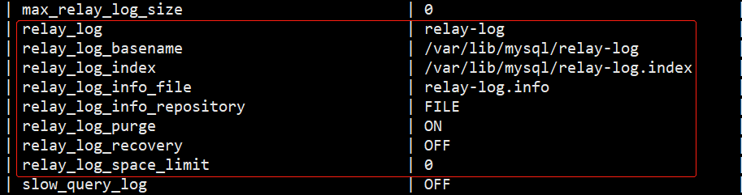

## mysql 主从复制集群
MySQL 主从复制与读写分离

MySQL作为目前世界上使用最广泛的免费数据库，在实际的生产环境中，由单台 MySQL 作为独立的数据库是完全不能满足实际需求的，无论是在安全性、高可用性及高并发等各个方面。

因此，一般来说都是通过主从复制（Master-Slave）的方式来同步数据，再通过读写分离（MySQL-Proxy）来提升数据库的并发负载能力，这样的方案来进行部署与实施。


### 复制功能
* 数据分布
* 负载均衡，针对数据读取
* 数据备份
* 高可用和故障切换
* MySQL 升级测试

### 复制方式
1、 主-从复制

2、 主-主复制

3、半同步复制

### 复制原理
MySQL 中有一种日志叫做 bin 日志（二进制日志），这个日志会记录下所有修改了数据库的 SQL 语句（insert， update， delete，alter，grant等），主从复制的原理就是把主数据库服务器上的 bin 日志复制到从数据库服务器上执行一遍，这样从数据库服务器上的数据就和主数据库服务器上的数据相同了。

### 复制流程图


### 复制过程
1、主节点必须启用二进制日志，记录任何修改数据库数据的事件。

2、从节点开启一个线程（I/O Thread）把自己扮演成 mysql 的客户端，通过 mysql 协议，请求主节点的二进制日志文件中的事件。

3、主节点启动一个线程（dump Thread），检查自己二进制日志中的事件，跟对方请求的位置对比，如果不带请求位置参数，则主节点就会从第一个日志文件中的第一个事件一个一个发送给从节点。

4、从节点接收到主节点发送过来的数据，把它放置到中继日志（relay log）文件中，并记录该次请求到主节点的具体哪个二进制日志文件的哪个位置。

5、从节点启动另外一个线程（sql Thread），把中继日志中的事件读取出来，并在本地再执行一次。

### 复制过程中线程的作用
#### 主节点
* dump Thread：为每个从节点的 I/O Thread 启动一个 dump 线程，用于向从节点发送二进制事件。

#### 从节点
* I/O Thread：从主节点请求二进制日志事件，并保存在中继日志中。
* sql Thread：从中继日志中读取日志事件，在本地完成执行。

从节点需要建立二进制日志文件吗？
视情况而定，如果从节点需要作为其他节点的主节点时，是需要开启二进制日志文件的，这种情况称之为级联复制。如果只是作为从节点，则不需要建立二进制文件。

### MySQL 复制特点
1、复制异步：主节点中一个用户请求一个写操作时，主节点不需要把写的数据在本地操作完成，并同时发送给从服务器并等待从服务器反馈写入完成，再响应用户。但是，从节点中的数据有可能会落后于主节点，可以使用一些软件来检查是否落后。

2、主从数据不一致。

### 主从复制配置过程

#### 主节点
1、启用二进制日志。

2、为当前节点设置一个全局唯一的 server_id。

3、创建具有复制权限的用户账号：replication slave，replication client。

#### 从节点
1、启动中继日志。

2、为当前节点设置一个全局唯一的 server_id。

3、使用具有复制权限的用户账号连接至主节点，并启动复制线程。

#### 主节点配置
1、启用二进制日志文件，在 /etc/my.cnf 中添加如下内容：
```angular2html
[mysqld]
log-bin=mysql-bin
server-id=1
innodb-file-per-table=ON
skip_name_resolve=ON
```
重启 mysqld 服务。

2、查看二进制日志是否开启
```angular2html
mysql> show global variables like '%log%';
```


3、查看主节点二进制日志列表
```angular2html
mysql> show master logs;
```


4、查看主节点的 server id
```angular2html
mysql> show global variables like '%server%';
```


5、在主节点上创建具有复制权限的用户，并刷新权限
```angular2html
grant replication slave, replication client on *.* to 'replxdhuxc'@'%' identified by 'Repl@163';
```


#### 从节点
1、开启中继日志，在 /etc/my.cnf 中添加如下内容：
```angular2html
relay-log=relay-log
relay-log-index=relay-log.index
server-id=2
innodb_file_per_table=ON
skip_name_resolve=ON
```
重启 mysqld 服务。

2、查看中继日志是否开启
```angular2html
mysql> show global variables like '%log%';
```


3、查看从节点 server 相关信息
```angularjs
mysql> show global variables like '%server%';
```


4、在从节点配置访问主节点的参数信息，添加主节点主机、访问主节点的用户名和密码，主节点二进制文件信息。

注意：主节点的二进制文件一定要是二进制列表中的最后一个二进制文件。