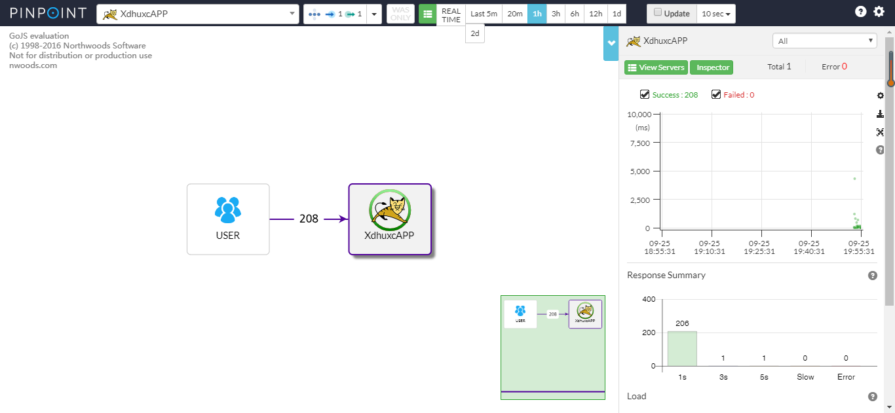

### 部署 Pinpoint

#### 前提条件
1、安装 JAVA，并配置 JAVA_HOME

2、下载 pinpoint 安装包（https://github.com/naver/pinpoint/releases）
* pinpoint-agent-1.8.0.tar.gz
* pinpoint-web-1.8.0.war
* pinpoint-collector-1.8.0.war
* pinpoint-master.zip

3、下载 hbase（http://apache.mirror.cdnetworks.com/hbase/stable/）
* hbase-1.4.7-bin.tar.gz


4、下载 tomcat
* apache-tomcat-9.0.12.tar.gz

#### 部署

##### 部署 hbase

1）启动 hbase 并检查启动状态
```angular2html
[root@xdhuxc bin]# pwd
/root/pinpoint/hbase-1.4.7/bin
[root@xdhuxc bin]# ls
draining_servers.rb   hbase-cleanup.sh  hbase-config.sh   hirb.rb                 region_mover.rb   rolling-restart.sh        stop-hbase.cmd  zookeepers.sh
get-active-master.rb  hbase.cmd         hbase-daemon.sh   local-master-backup.sh  regionservers.sh  shutdown_regionserver.rb  stop-hbase.sh
graceful_stop.sh      hbase-common.sh   hbase-daemons.sh  local-regionservers.sh  region_status.rb  start-hbase.cmd           test
hbase                 hbase-config.cmd  hbase-jruby       master-backup.sh        replication       start-hbase.sh            thread-pool.rb
[root@xdhuxc bin]# ./start-hbase.sh 
running master, logging to /root/pinpoint/hbase-1.4.7/bin/../logs/hbase-root-master-xdhuxc.out
Java HotSpot(TM) 64-Bit Server VM warning: ignoring option PermSize=128m; support was removed in 8.0
Java HotSpot(TM) 64-Bit Server VM warning: ignoring option MaxPermSize=128m; support was removed in 8.0
[root@xdhuxc bin]# jps  # 使用 jps 命令查看 hbase 是否启动成功，如果看到 ‘HMaster’ 的进程，则表明 hbase 启动成功。
7926 HMaster
7974 Jps
```

2）初始化 pinpoint 所需的表（https://github.com/naver/pinpoint/blob/master/hbase/scripts/hbase-create.hbase）
```angular2html
[root@xdhuxc bin]# pwd
/root/pinpoint/hbase-1.4.7/bin
[root@xdhuxc bin]# ls
draining_servers.rb   hbase-cleanup.sh  hbase-config.sh     hbase-jruby             master-backup.sh  replication               start-hbase.sh  thread-pool.rb
get-active-master.rb  hbase.cmd         hbase-create.hbase  hirb.rb                 region_mover.rb   rolling-restart.sh        stop-hbase.cmd  zookeepers.sh
graceful_stop.sh      hbase-common.sh   hbase-daemon.sh     local-master-backup.sh  regionservers.sh  shutdown_regionserver.rb  stop-hbase.sh
hbase                 hbase-config.cmd  hbase-daemons.sh    local-regionservers.sh  region_status.rb  start-hbase.cmd           test
[root@xdhuxc bin]# ./hbase shell hbase-create.hbase 
```
使用命令查看导入的表
```angular2html
./hbase shell
status 'detailed'
```

##### 部署 Pinpoint-collector

1）将 pinpoint-collector-1.8.0.war 复制到 apache-tomcat-9.0.12/webapps/ 目录下，修改 pinpoint-collector-1.8.0/WEB-INF/classes 目录下的文件 hbase.properties，
修改如下内容：
```angular2html
hbase.client.host=localhost
hbase.client.port=2181
```
指向 zookeeper 的地址和端口。如果是本机，端口默认，则这里无需更改。


##### 部署 Pinpoint-web

1）将 pinpoint-web-1.8.0.war 复制到 apache-tomcat-9.0.12/webapps/ 目录下，修改 pinpoint-web-1.8.0/WEB-INF/classes 目录下的文件 hbase.properties，
修改如下内容：
```angular2html
hbase.client.host=localhost
hbase.client.port=2181
```
指向 zookeeper 的地址和端口。如果是本机，端口默认，则这里无需更改。

##### 部署 Pinpoint-Agent

1）创建目录 pinpoint-agent 并解压 pinpoint-agent-1.8.0.tar.gz 到该目录下
```angular2html
mkdir pinpoint-agent && tar -zxf pinpoint-agent-1.8.0.tar.gz -C pinpoint-agent
```

2）配置 pinpoint.config
```angular2html
profiler.collector.ip=127.0.0.1
```
这是指 pinpoint-collector 的地址，如果是同一服务器，则无需修改。

3）安装 pinpoint-collector 启动后，自动就开启了9994，9995，9996的端口了，这里默认即可。
如果有端口需求，要去 pinpoint-collector 的配置文件 pinpoint-collector-1.8.0/WEB-INF/classes/pinpoint-collector.properties 中，修改这些端口。


##### 部署测试应用
1）修改 tomcat 的 catalina.sh 文件，加入如下内容
```angular2html
CATALINA_OPTS="$CATALINA_OPTS -javaagent:/root/pinpoint/pinpoint-agent/pinpoint-bootstrap-1.8.0.jar"
CATALINA_OPTS="$CATALINA_OPTS -Dpinpoint.agentId=xdhuxc"
CATALINA_OPTS="$CATALINA_OPTS -Dpinpoint.applicationName=XdhuxcAPP"
```
第一行，指定 pinpoint-bootstrap-1.8.0.jar 的位置。

第二行，指定 agentId，必须唯一，用于标志一个 JVM。

第三行，指定 applicationName，表示同一种应用，同一个应用的不同实例应用使用不同的 agentId，相同的 applicationName。

此时，apache-tomcat-9.0.12/webapps 目录结构如下：
```angular2html
[root@xdhuxc webapps]# pwd
/root/pinpoint/apache-tomcat-9.0.12/webapps
[root@xdhuxc webapps]# ls
docs  examples  host-manager  jenkins  jenkins.war  manager  pinpoint-collector  pinpoint-web  ROOT
```

##### 部署 spring boot 项目

如果是以 jar 包方式部署 spring boot 项目，直接在启动命令中添加启动参数：
```angular2html
nohup java -javaagent:/root/pinpoint/pinpoint-agent/pinpoint-bootstrap-1.8.0.jar -Dpinpoint.agentId=xdhuxc -Dpinpoint.applicationName=XdhuxcAPP -jar xdhuxc.jar &
```

在 apache-tomcat-9.0.12/webapps 目录下放置要监控的应用程序 war 包，然后启动 tomcat。

##### 访问 Pinpoint 管理页面

访问如下路径：
http://172.20.26.149:8080/pinpoint-web

如下图所示：



### 参考资料

https://blog.csdn.net/heyeqingquan/article/details/74456591

http://naver.github.io/pinpoint/1.8.0/main.html